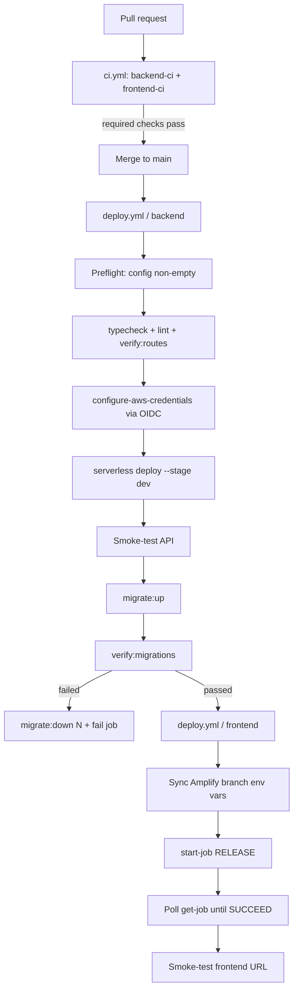

# CI/CD

Two GitHub Actions workflows own the pipeline. A one-time bootstrap wires the
AWS side up; after that, **merging to `main` is the only action required.**

| Workflow | Trigger | Purpose |
| --- | --- | --- |
| [`ci.yml`](../.github/workflows/ci.yml) | pull request → `main` | typecheck, lint, route parity, production build |
| [`deploy.yml`](../.github/workflows/deploy.yml) | push → `main`, manual | deploy backend → migrations → deploy frontend |

`main` is intentionally covered by `deploy.yml` only: it runs the same gates
immediately before deploying, so a merge is never checked twice.

## Pipeline



The two jobs are sequential (`frontend` needs `backend`) because the Next.js
server proxies every call to the API — the backend must be live before the
frontend that calls it is released.

## Why the frontend deploy triggers Amplify instead of building it

AWS documents that **"Amplify Hosting does not support manual deploys for
server-side rendered (SSR) apps."** This is a Next.js SSR app, so the pipeline
cannot build an artifact and upload it (`create-deployment` / `start-deployment`
are not options). Instead `deploy.yml` drives Amplify's own builder:

```bash
aws amplify start-job   --job-type RELEASE --commit-id <sha>   # trigger
aws amplify get-job                                            # poll to completion
```

Consequences worth knowing:

- **Branch auto-build is switched off.** The bootstrap sets
  `enableAutoBuild: false` on branch `main`, so a push does *not* start an
  Amplify build. The pipeline is the only thing that releases the frontend, which
  is what makes the backend-first ordering possible. Verify with
  `aws amplify list-jobs --app-id <id> --branch-name main`: one merge should
  produce exactly one job.
- **`RELEASE` builds the branch head**, so if a second merge lands while the
  first pipeline is still running, it is queued (`cancel-in-progress: false`) and
  then builds the newer commit. The `commit-id` argument is recorded for traceability.
- **A failed frontend build does not break the live site.** Amplify keeps serving
  the last successful deployment, so only the new code fails to ship.

## What CI enforces

| Gate | Command | Notes |
| --- | --- | --- |
| Backend types | `npm run typecheck` | must be 0 errors |
| Backend lint | `npm run lint` | config is `backend/.eslintrc.cjs`; 2 deliberate warnings |
| Route parity | `npm run verify:routes` | catches a handler with no route block in `serverless.yml` |
| Backend bundle | `npm run build` | `serverless package`; needs no AWS credentials |
| Frontend types | `npx tsc --noEmit` | |
| Frontend lint | `npm run lint -- --max-warnings=0` | zero-warning gate |
| Frontend build | `npm run build:amplify` | the **exact** command Amplify runs, not `npm run build` (that forces turbopack) |

## One-time bootstrap

```bash
# Requires the AWS CLI authenticated as an admin.
# Requires the gh CLI authenticated, to write secrets and variables.
./scripts/bootstrap-cicd.sh
```

It is idempotent — re-running is safe and is the way to pick up a policy change.
It creates:

1. the GitHub OIDC identity provider in IAM
   (`token.actions.githubusercontent.com`, audience `sts.amazonaws.com`);
2. the deploy role `GitHubActionsDeploy-KaBarangayConnect`, trusting **only**
   `repo:<owner>/<repo>:ref:refs/heads/main`, with a least-privilege inline policy
   (CloudFormation, Lambda, API Gateway, Logs, S3, the Lambda execution role,
   Amplify, and Cognito for the maintenance scripts);
3. the Amplify app + branch, reusing an existing app by name if one is found;
4. every GitHub secret and variable, read from `backend/.env`.

Two caveats:

- If **no Amplify app exists yet**, programmatic creation needs a GitHub PAT
  (`GITHUB_PAT`, classic, `repo` scope) because the Amplify API has to
  authenticate to GitHub to attach the repository. If you would rather not use a
  PAT, create the app once in the Amplify console (connect this repo, branch
  `main`) and re-run the script — it will detect and reuse it.
- If the app's `platform` is not `WEB_COMPUTE`, the script warns; Next.js SSR
  requires it (`aws amplify update-app --app-id <id> --platform WEB_COMPUTE`).

Run `SKIP_GITHUB=1 ./scripts/bootstrap-cicd.sh` to do the AWS half only and print
the list of values to add by hand.

## Configuration inventory

Set by the bootstrap; listed here so the pipeline can be reproduced by hand.

**Secrets**

| Name | Source | Used for |
| --- | --- | --- |
| `AWS_DEPLOY_ROLE_ARN` | bootstrap | OIDC role assumption |
| `MONGODB_URI` | `backend/.env` | Lambda runtime + migrations |
| `JWT_SECRET` | `backend/.env` | session JWT signing |
| `TOTP_SECRET_ENCRYPTION_KEY` | `backend/.env` | legacy admin TOTP secret at rest |
| `GOOGLE_CLIENT_SECRET` | `backend/.env` | resident Google SSO |
| `OAUTH_STATE_SECRET` | `backend/.env` | optional; falls back to `JWT_SECRET` |
| `COGNITO_CLIENT_SECRET` | `backend/.env` | `SECRET_HASH` for the Cognito challenge calls; only needed when the app client has a generated secret |

**Variables**

`AWS_REGION`, `STAGE`, `API_BACKEND_URL`, `AMPLIFY_APP_ID`,
`AMPLIFY_BRANCH_NAME`, `SESSION_COOKIE_MAX_AGE_SECONDS`, `JWT_EXPIRES_IN`,
`TOTP_ISSUER`, `TOTP_ENROLLMENT_JWT_TTL`, `COGNITO_USER_POOL_ID`,
`COGNITO_CLIENT_ID`, `COGNITO_REGION`, `GOOGLE_CLIENT_ID`, `GOOGLE_REDIRECT_URI`,
`S3_BUCKET_NAME`, `S3_BUCKET_REGION`.

`COGNITO_OFFLINE` is hard-coded to `false` in the workflow — it is a local
development escape hatch and must never reach a deployed environment.

> The preflight step also asserts `COGNITO_USER_POOL_ID`, `COGNITO_CLIENT_ID`
> and `COGNITO_CLIENT_SECRET`, because `serverless.yml` resolves each with
> `${env:X, ''}` — an unset value would ship an empty string and admin login
> would only fail later, at runtime, with a 500 that names no cause.

The Lambda execution role's `cognito-idp` grants live in
`backend/serverless.yml` (`provider.iam.role.statements`), so they ship with the
stack: an out-of-band console policy is not reproducible and does not survive a
stack rebuild. `npm run verify:routes` fails the build when a Cognito action the
gateway uses is not granted there, or when `COGNITO_CLIENT_SECRET` is missing
from the provider environment block.

### Where the frontend's config actually lives

`deploy.yml` re-asserts the Amplify branch environment variables on every deploy,
so GitHub is the single source of truth:

```
API_BACKEND_URL, API_BACKEND_STAGE, SESSION_COOKIE_MAX_AGE_SECONDS, COOKIE_SECURE
```

> `aws amplify update-branch --environment-variables` **replaces the whole map.**
> The workflow always sends the complete set; if you add a variable, add it to the
> workflow's `Sync Amplify branch config` step too or the next deploy will drop it.

These must exist for **both** the build and the SSR runtime: `next.config.ts`
reads `API_BACKEND_URL` at build time for `rewrites()`, while
`src/app/api/backend/[...path]/route.ts`, `src/app/api/admin/profile/route.ts`,
and `src/lib/session-guard.ts` read it per request. Never put `MONGODB_URI` or
`JWT_SECRET` in Amplify — the Next server only proxies to the backend.

## Migrations

`backend/package.json` exposes `migrate:status`, `migrate:up`, `migrate:down`,
and `verify:migrations`. The pipeline runs, in order:

1. `npm run migrate:status` — log which migrations are pending;
2. `npm run migrate:up` — apply them;
3. `npm run verify:migrations` — assert the database is actually in the shape the
   app expects: reachable, every migration on disk recorded in
   `schema_migrations`, every index in `SEEDED_INDEXES` present, every populated
   collection queryable.

**If step 3 fails**, the workflow runs `migrate:down <N>` (where `N` is exactly
how many migrations this run applied), re-verifies, and fails the job.

**If step 2 fails**, nothing is reverted — deliberately. `runUp()` records a
migration in the changelog only *after* its `up()` resolved, so a migration that
throws halfway leaves partial writes that the changelog does not know about and
that `migrate:down` cannot find. That case needs a human.

### Index drift is reported, not fatal

`verify:migrations` matches an expected index on its **key pattern and options**,
not its name, because the Mongoose models also declare `unique` / `sparse` fields
whose auto-generated names can legitimately shadow the migration's name. For
example, `residents` currently carries `residentId_1` (from
`resident.model.ts`) instead of the migration's `unique_residentId`. They are the
same constraint — same key, `unique`, `sparse` — so this is reported as a note:

```
Notes (not fatal):
  - residents: "unique_residentId" exists as "residentId_1" (same key and options — cosmetic name drift)
```

If you would rather the two agree, either drop `unique: true, sparse: true` from
`residentId` in `resident.model.ts` or remove the duplicate entry from
`SEEDED_INDEXES` — but note that MongoDB cannot hold two indexes on the same key
under different names, so exactly one of them will win.

## Rollback runbook

**Revert the last migration**

```bash
npm --prefix backend run migrate:down -- 1
npm --prefix backend run migrate:status
```

**Roll back the backend infrastructure** (CloudFormation; replaces the API with
the previous successful update)

```bash
npm --prefix backend run verify:routes
npx --prefix backend serverless rollback --stage dev -v 1
```

**Re-run the pipeline without a new commit**

```bash
gh workflow run deploy.yml --ref main
```

**Revert the frontend** — Amplify keeps every previous deployment. In the Amplify
console, open the branch's build history and *Redeploy* an earlier successful job.
A failed build never replaces the live site, so there is usually nothing to undo.

Because the frontend and backend deploy as one pipeline but are separate systems,
a failure after the backend has deployed leaves the backend live and the frontend
unchanged. That is intentional: backend changes are verified by the API smoke test
and the migration check before the frontend is even triggered, and an automated
`sls rollback` is a heavier action than the incident warrants.

## Troubleshooting

**`AMPLIFY_APP_ID is not set`** — run `./scripts/bootstrap-cicd.sh` once.

**The frontend deploy hangs at "Wait for Amplify build"** — inspect the job:
`aws amplify get-job --app-id <id> --branch-name main --job-id <n>`. The workflow
prints each step's `logUrl` on failure. The usual cause is a build failure that CI
did not catch, such as an Amplify-only environment variable.

**A route 404s in production** — `serverless.yml` is the only route registry, and a
handler file with no route block is a silent 404 rather than a compile error. Run
`npm --prefix backend run verify:routes`. Remember a route-table change needs a
full `npm run offline` restart locally (and a real deploy in production);
`reloadHandler` only reloads handler code.

**The API smoke test fails with a non-400 status** — the deploy itself failed
partway, or API Gateway is not routing. Check the CloudFormation stack events.

**Watch out for 403 vs 401.** `/auth/session` sits behind the `auth-jwt` REQUEST
authorizer, which returns a bare Deny policy with no `context.statusCode`, so API
Gateway answers **403** for a missing or invalid `Authorization` header — the same
status it uses for a non-existent path. Only `serverless-offline` reports 401. The
smoke test therefore asserts on a public route's response *body* instead, which is
the only signal that actually distinguishes "deployed and working" from "route
missing".

## Notes and follow-ups

- **`dev` is the only deployed stage, and it is effectively production.** The live
  API is `https://5p91o0g2ea.execute-api.ap-southeast-1.amazonaws.com/dev/`.
  Adding a real `prod` stage would need a second API Gateway, an updated Amplify
  `API_BACKEND_URL`, and re-registering the Cognito and Google redirect URIs.
- **`backend/.env` contains live, long-lived AWS access keys.** They are gitignored
  and CI uses OIDC, so they are not needed for deployments — rotate them.
- **Atlas network access must allow the Lambda egress addresses** (`0.0.0.0/0` or
  PrivateLink). Otherwise the deploy smoke test can pass while the app 500s.
- Not covered: a `staging`/`prod` split, backend PR preview environments,
  dependency updates (Dependabot), and a WebSocket deploy step — `serverless.yml`
  declares no `websocket` events, so real-time delivery falls back to polling.
